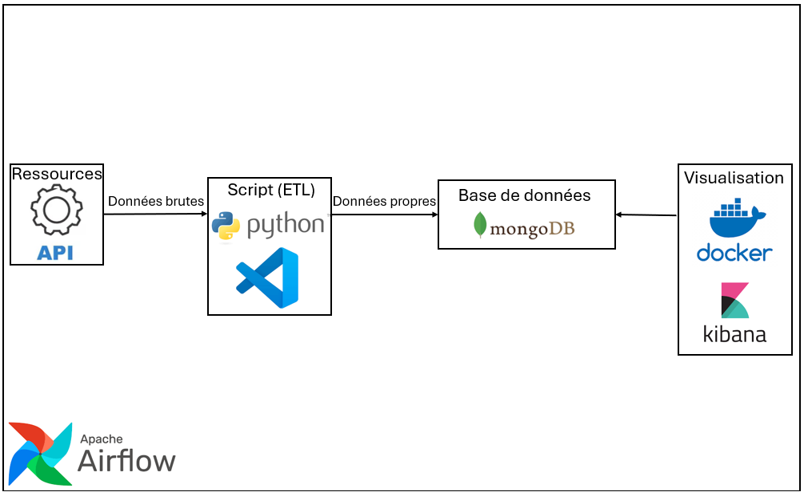

# Projet : Récupération et visualisation de deux APIS

## Technologies Utilisées

### Langage


---

## Objectif du Projet

L'ensemble de ces outils ont été utilisé pour le projet d'implémentation et utilisation de deux APIS. Il visent à ingérer, transformer, et analyser des données en temps réel pour obtenir des insights sur les vols d'avions (atteris, en vol ou en décolage) selon la météo en temps réel. Les données sont ensuite visualisées à l'aide d'Elasticsearch et Kibana.

##  Mes cibles

Mes cibles principales incluent :

- **Données francaise :** Visualisation de l'ensemble des vols en partances d'aéroport francais

- **Condition météorologique :** Prendre les conditions météos (Température,Pression atmosphérique, direction du vent)

## Architecture du projet 




### Workflow et Schéma d'Architecture


1. **Ingestion des Données Vol en temps réel (API "AVIONSTACK")** :
   - Extraction des informations sur les vols ou futures vols via l'API AVIONSTACK, envoi des données dans MongoDB.

1. **Ingestion des Données de météo en temps réel (API "AVIONSTACK")** :
   - Extraction des informations sur les vols ou futures vols via l'API AVIONSTACK, envoi des données dans MongoDB.


## Déroulement Technique du Projet

### **Étapes d'installation :**


1. **Créer un environnement virtuel :**
   ```bash
   python -m venv venv
   source venv/bin/activate  # Unix
   # Ou
   venv\Scripts\activate     # Windows
  
2. **Installer les dépendances :**
   ```bash
   pip install -r requirements.txt
   ```
**Configurer les variables d'environnement :**
   Créez un fichier `.env` et renseignez les informations de connexion MongoDB, Airflow ainsi que les liens des deux différents APIs  :
   ```env
MONGO_USERNAME="******"
MONGO_PASSWORD="******"
MONGO_DBNAME="*******"
MONGO_URI="*********"
API_URL=http://api.aviationstack.com/v1/flights?access_key=e574184ee43fcf4700913de235d32663

Airflow_username : admin
Airflow_firstname : admin
Airflow_lastname : admin
Airflow_role : Admin
Airflow_email : admin@example.com
Airflow_password : admin
   ```

## Visualisation des données avec Kibana